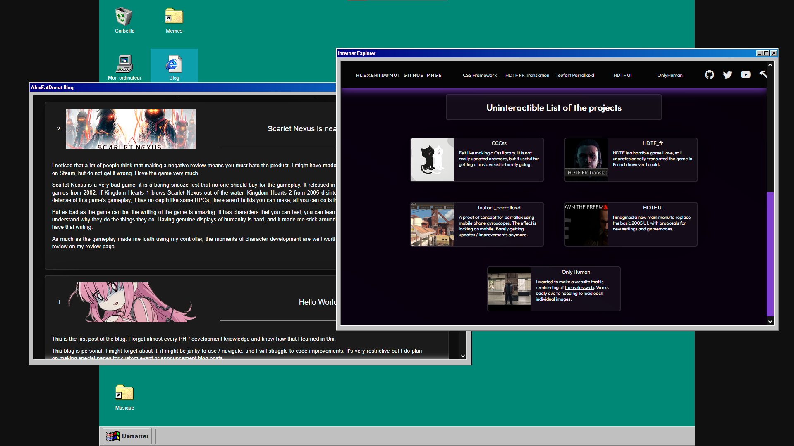

# win98-website-concept

Old project attempting to make my website into win98.

This was a personal website project made that would have been alexeatdonut.net. I haven't gotten around to actually complete it in over 2 years.

Includes every single Windows 98 icons, for some reason. I had a weird workflow.

Requires you to set it up in Xampp and to fill in content yourself. I'm also not including my own data (obviously).
